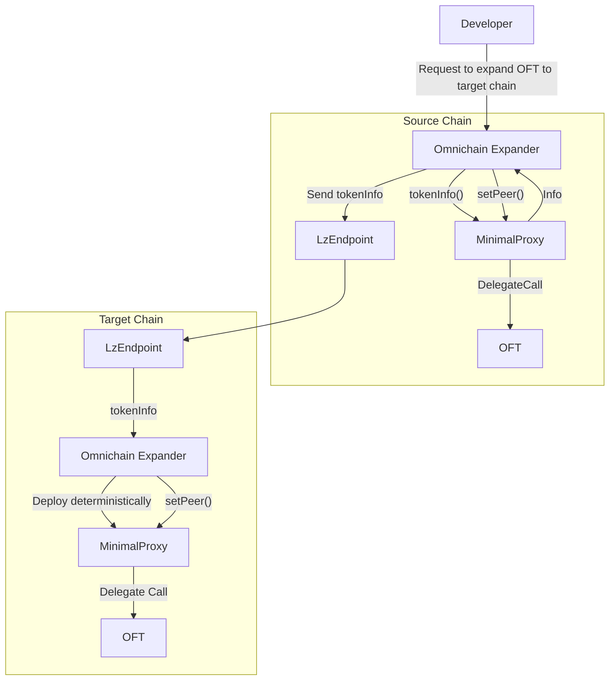
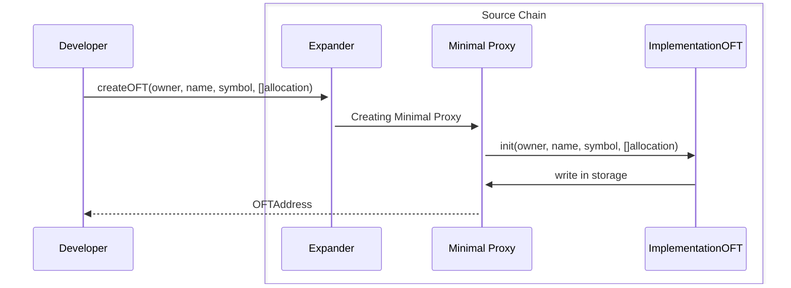
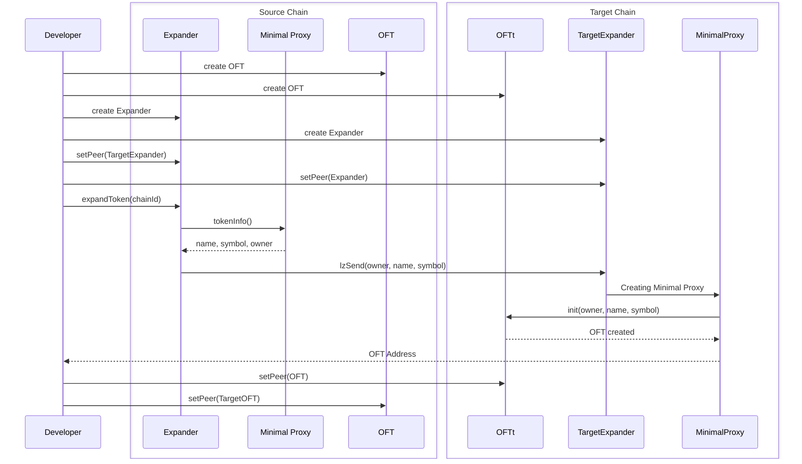
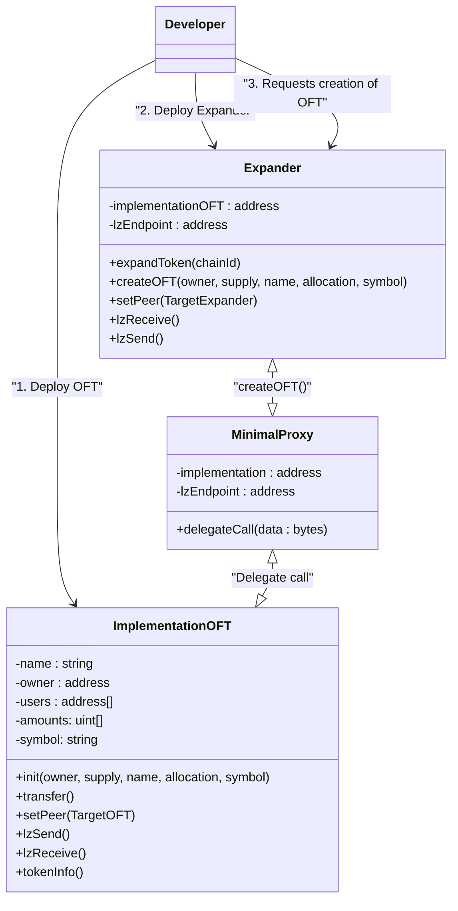

# Automatically Expanding Omnichain Systems (Alpha verison)

## Based on MIP-01

### Flowchart of token expanding

### Creating an OFT based on the MinimalProxy pattern

### Expanding to other chain

### Class diagram

